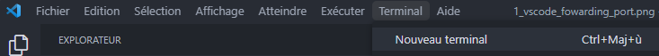
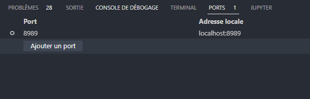

# Introduction

Maintenant, que vous avez vu comment installer le projet, nous allons voir ensemble comment l'utiliser et ceci étapes par étapes.

!!! warning "Attention"
    Avant de passer à la prochaine étape assurez de bien avoir installé les [prérequis](install-myd-project.md) ainsi que d'avoir créé votre [premier](mkdocs-website.md) site avec [MkDocs](https://www.mkdocs.org/){.internal-link target=_blank}.

## Comment on se sert du projet ?

### Préparation

Si vous avez tout bien installé, aller dans le répertoire du projet et vous devriez avoir ceci :

```console
Myd-project/
│
├── debian_myd/
│   ├── build-debian.sh
│   └── debian_myd.dockerfile
│
├── python_myd/
│   ├── build-python.sh
│   └── python3.10.4.dockerfile
│
├── nginx/
│   ├── build-myd-docs.sh
│   ├── myd-docs.dockerfile
│   └── run-nginx.sh
|
├── conf/
|   └── exemple.conf
|
├── logs/
|
├── requirement.txt
|
└── myd.py
```

On peut désormais regarder comment le projet fonctionne en utilisant la commande suivante :

<div class="termy">
```console
$ (env-myd) python myd.py --help
                                                                                                           
 Usage: myd.py [OPTIONS] COMMAND [ARGS]...                                                                 
                                                                                                           
╭─ Options ──────────────────────────────────────────
--install-completion   Install completion for the current shell.
--help                 Show this message and exit.
--show-completion      Show completion for the current shell, to copy it
                       or customize the installation.

╭─ Commands 💻 ───────────────────────────────────────
build     Build each Docker container as needed to run. 🧱
config    Create configuration file for Myd. ✍
run       Launches the Nginx server. 🚀

```
</div>

Nous verrons plus tard ensemble comment utiliser les différentes commandes.

### Création du fichier de configuration

Pour pouvoir utiliser **Myd**, il vous faudra au préalable générer le fichier de configuration.

!!! warning "Attention"
    Le fichier de configuration est formaté de manière que **Myd** puisse comprendre les différentes informations nécessaires à son bon fonctionnement. Vous ne pouvez pas changer l'ordre des lignes ou ajouter des commentaires.

Pour générer le fichier de configuration dans le bon format que **Myd** à besoins, il suffit d'utiliser la commande ```config```.

Regardons comment la commande fonctionne :

<div class="termy">
```console
$ (env-myd) python myd.py config --help
                                                                                         
 Usage: myd.py config [OPTIONS]                                                                            
                                                                                                           
 Create configuration file for Myd. ✍                                                                      
                                                                                                           
╭─ Options ──────────────────────────────────────────────────
--edit    --no-edit      Used to modify any existing configuration file
                         [default: no-edit]
--help                   Show this message and exit.

```
<BR>
</div>

On peut désormais crée notre premier fichier de configuration.

<div class="termy">
```console
$ (env-myd) python myd.py config

<span style="color: lime;">Input name you want for configuration file:</span>

$ (env-myd) exemple

<span style="color: lime;">Input name you want for configuration file:</span>

$ (env-myd) votre-url-docker

<span style="color: lime;">Input Python version (3.X.X):</span>

$ (env-myd) 3.10.4

<span style="color: lime;">Input GitHub Token:</span>

$ (env-myd) votre_token_GitHub

<span style="color: lime;">Input GitHub Repository:</span>

$ (env-myd) https://github.com/votre-nom-d'utilisateur/nom-du-repo/archive/nom-de-la-branche.zip

<span style="color: lime;">Input external port will be used to run server:</span>

$ (env-myd) 8989

<span style="color: lime;">Success</span>: The file '<span style="color: red;">exemple.conf</span>' has been created successfully
```
<BR>
</div>

Maintenant, que le fichier est créé, vous devriez avoir un fichier ```.conf``` dans le dossier ```conf``` du projet.

Il devrait être présenté comme ceci :

```
REPO_DOCKER_URL=votre-url-docker
PYTHON_VERSION=3.10.4
GIT_TOKEN=votre_token_github
GIT_REPO=https://github.com/votre-nom-d'utilisateur/nom-du-repo/archive/nom-de-la-branche.zip
EXT_PORT=8989
```

!!! warning "Attention"
    L'URL du répertoire **GitHub** doit être formaté comme ci-dessus, vous ne pouvez pas simplement faire un copié de l'URL. Il ne faut également pas de */* à la fin de votre URL Docker.


### Mise en place des containers

Pour pouvoir faire fonctionner notre serveur web [Nginx](https://www.nginx.com/){.internal-link target=_blank}, il faut au préalable établir le container dans lequel on retrouveras notre site web généré par [MkDocs](https://www.mkdocs.org/){.internal-link target=_blank}.

Regardons comment cela fonctionne :

<div class="termy">
```console
$ (env-myd) python myd.py build --help

 Usage: myd.py build [OPTIONS] File Option                                                   
                                                                                                           
 Build each Docker container as needed to run. 🧱                                                          
                                                                                                           
╭─ Arguments ─────────────────────────
file   File    Enter which configuration file you want use:
               [exemple.conf, ...][required]

╭─ Options ───────────────────────────
option Option  Use to build specific container: debian, python,
               nginx [default: all] 
               
--help          Show this message and exit.
```
<BR>
</div>

On peut voir que contrairement à ```config``` on a ici un argument obligatoire qui est le fichier que vous avez normalement créé précédemment.

Avant de continuer regardons à quoi sert l'argument ```option```. **Myd** a besoin de créer différents containers pour établir le serveur web final.

On crée tout d'abord un container [Docker](https://www.docker.Lcom/){.internal-link target=_blank} avec un image **Debian bulleye slim** qui est l'environnement **Linux** dans lequel notre serveur web va être déployés. 

Ensuite, on crée notre propre container **Python** depuis l'image **Debian** où on installe donc **Python**.

Enfin, on crée le container [Nginx](https://www.nginx.com/){.internal-link target=_blank} en y ajoutant les pages de notre site web récupéré depuis le lien du répertoire GitHub présent dans le fichier de configuration.

Par défaut l'argument ```option``` est égal à ```all``` ce qui signifie que tous les containers vont être recréé. Cependant, on n'a pas toujours besoin de reconstruire tous les containers, c'est pour ça qu'```option``` permet de construire spécifiquement le container choisis.

!!! note
    La commande ```build``` peux prendre un long moment la première fois pour générer pas de panique tant que le chargement est en cour c'est que les containers sont en train d'être construit.

Pour notre premier lancement, nous allons effectuer la commande suivante :

<div class="termy">
```console
$ (env-myd) python myd.py build exemple.conf

Building debian container...
<span style="color: lime;">The debian container has been successfully built</span>

Building python container...
<span style="color: lime;">The python container has been successfully built</span>

Building nginx container...
<span style="color: lime;">The nginx container has been successfully built</span>

<span style="color: cyan;">Everything finished being built !</span>

```
<BR>
</div>

!!! info
    Si vous souhaitez voir ce qu'a renvoyé chacun des containers, vous trouverez dans le dossier ```logs``` tous les fichiers ```logs``` des différents containers.

Si vous voyez le message vous disant que tout a bien été construit, vous pouvez maintenant passer à la prochaine étape, si vous avez quelconque souci hésité pas à lire les informations de votre fichier de configuration ainsi que les fichiers ```logs```.

### Lancement de **Myd**

Maintenant, vous êtes prêt pour le lancement de votre site hébergé par [Nginx](https://www.nginx.com/){.internal-link target=_blank}. Regardons comment cela fonctionne :

<div class="termy">
```console
$ (env-myd) python myd.py run --help

 Usage: myd.py run [OPTIONS] File External_port 

 Launches the Nginx server. 🚀                                                        
                                                                                                           
╭─ Arguments ─────────────────────────
file   File             [required] Enter which configuration file you
                        want use: [exemple.conf, ...]
                        
ext_port External_port  [required] External port web server will use

╭─ Options ───────────────────────────
--help          Show this message and exit.
```
<BR>
</div>

Vous devez une nouvelle fois ici spécifier votre fichier de configuration à utiliser, mais aussi le **port externe** que vous souhaitez utiliser. Faîtes de sortes à ce que le port soit une valeur haute entre *8000* et *9000* par exemple pour éviter les conflits avec des ports pouvant déjà être utilisée par d'autres programmes.

Une fois les containers construits, vous pouvez lancer la commande ci-dessous :

<BR>
<div class="termy">
```console
$ (env-myd) python myd.py run me.conf 8989

Running nginx container on external port: 8989...
<span style="color: lime;">Success: The server is running on external port 8989</span>
```
<BR>
</div>

!!! info
    Il est possible que lorsque vous effectuez des modifications sur votre site sur [GitHub](https://github.com/){.internal-link target=_blank} cela ne fonctionne pas, il faut supprimer les images [Docker](https://www.docker.com/){.internal-link target=_blank} ([Docker](https://www.docker.com/){.internal-link target=_blank} utilise un cache est votre site n'est pas télécharger à nouveau depuis votre répertoire).

Si tout, c'est bien passé, vous devriez pouvoir accéder à votre page web, avant cela assurer vous d'avoir fait la redirection de port.

Pour le faire, vous devrez vous rendre dans [Visual Studio Code](https://code.visualstudio.com/){.internal-link target=_blank}. Puis ouvrez un terminal en cliquant ici :



Maintenant, vous devriez avoir une petite fenêtre en bas de l'écran qui s'est ouvert.
Pour l'exemple lors de la configuration, j'ai choisi le port ```8989```. Il ne vous reste plus qu'à ajouter votre port en cliquant sur "Ajouter un port".



Enfin, vous pouvez désormais accéder à votre page web en marquant l'URL suivant:
```http://localhost:votre-port/```

Si tout, c'est bien passé, vous devriez voir votre site apparaître !

!!! tip "Remerciment"
    Je vous remercie d'avoir lu jusqu'ici, j'espère avoir été claire dans mes explications.

Vous souhaitez mettre votre site sur [GitHub Pages](https://github.com/){.internal-link target=_blank}, pour ce faire rendez-vous [ici](install-on-github-pages.md)