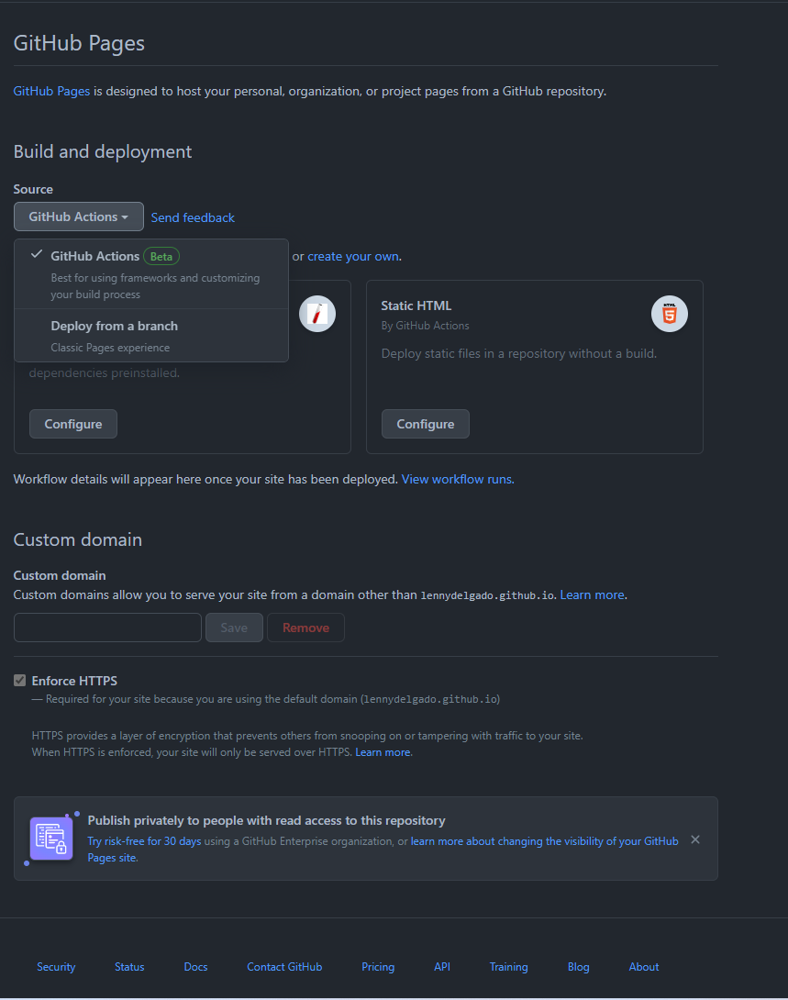
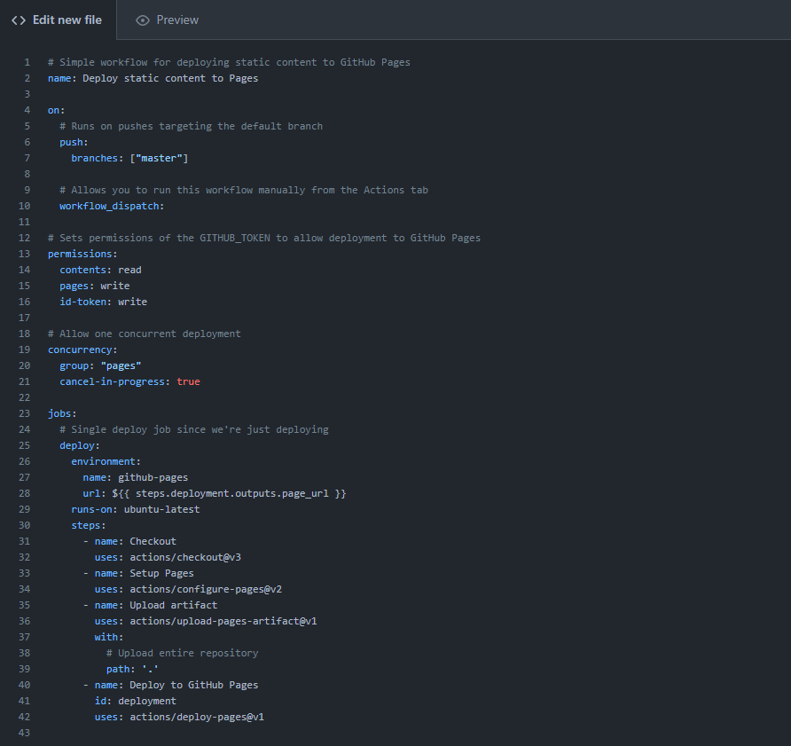
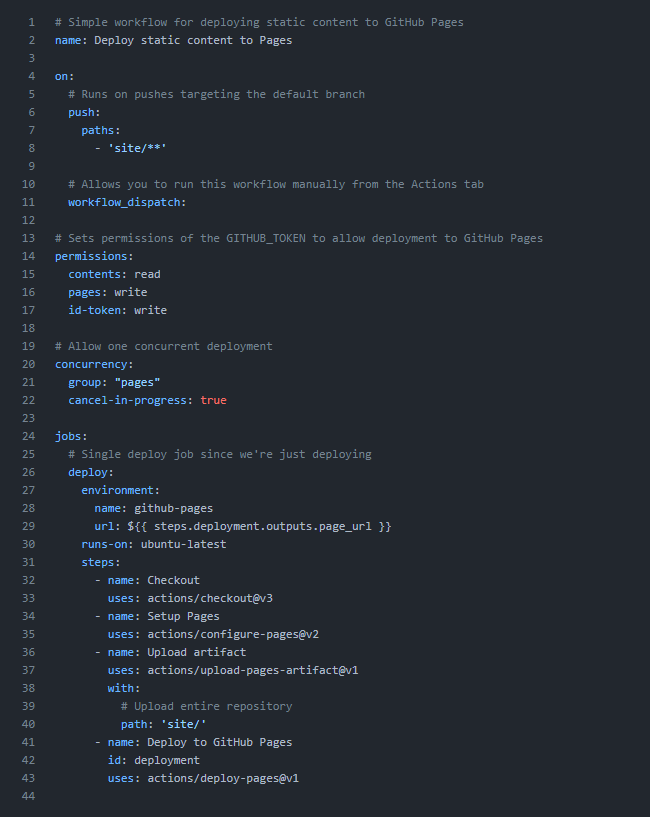

# Introduction

Pour pouvoir mettre votre site sur [GitHub Pages](https://docs.github.com/en/pages/getting-started-with-github-pages/about-github-pages){.internal-link target=_blank} vous aurez besoin d'avoir crée un compte [GitHub](https://github.com/){.internal-link target=_blank} ainsi que crée votre répertoire qui va contenir votre documentation.

!!! note
    Pour pouvoir utiliser [GitHub Pages](https://docs.github.com/en/pages/getting-started-with-GitHub-pages/about-GitHub-pages){.internal-link target=_blank} de manière gratuite il vous faudra **obligatoirement** un répertoire [GitHub](https://github.com/){.internal-link target=_blank} **public**. Pour mettre votre site en privée il vous faudra avoir un abonnement sur [GitHub](https://github.com/){.internal-link target=_blank} pour plus d'information rendez-vous [ici](https://docs.github.com/en/pages/getting-started-with-github-pages/about-github-pages){.internal-link target=_blank}.

## Récupération du site

Si vous n'avez pas eu de problème lors du ```build```, un nouveau dossier est apparu sur votre répertoire GitHub et il se nomme ```site```.

Ce dossier contient toutes les pages **HTML** générées par [MkDocs](https://www.mkdocs.org/){.internal-link target=_blank}, si le dossier est bien présent nous pouvons passer à l'étape d'après sinon relancer vous-même une génération.

## Mise en ligne sur GitHub Pages

Afin de mettre votre site sur [GitHub Pages](https://docs.github.com/en/pages/getting-started-with-github-pages/about-github-pages){.internal-link target=_blank} rendez-vous sur la page internet de votre répertoire puis dans *settings* puis dans *pages* comme ci-dessous.


Par la suite vous choisissez la méthode de déploiement par une [GitHub Action](https://docs.github.com/en/actions){.internal-link target=_blank} et vous cliquez sur configure en dessous de **Static HTML**.



Vous devriez normalement tombez sur cette page.



Nous allons modifier ce fichier pour faire que dès lors on utilise **Myd**, la génération et la publication se fasse automatiquement lors d'une modification dans le dossier site. Il faut effectuer des modifications aux lignes 7 et 39 comme ci-dessous. 



Vous pouvez enregistrer, grâce à ça dès que vous utiliserez à nouveaux **Myd** votre documentation seras mise à jour.
