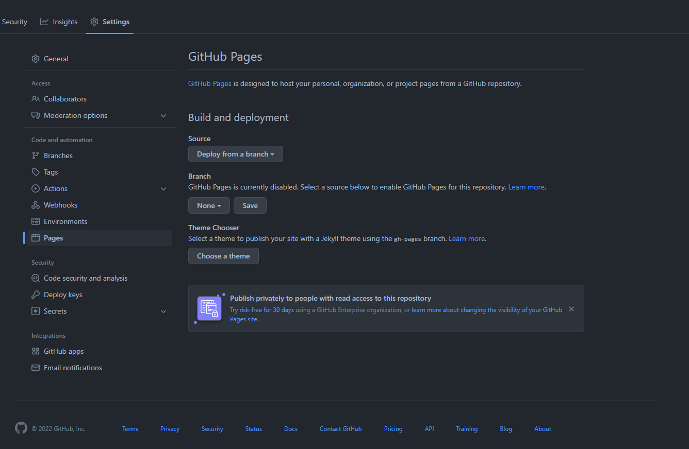

# Introduction

Pour pouvoir mettre votre site sur [GitHub Pages](https://docs.github.com/en/pages/getting-started-with-github-pages/about-github-pages){.internal-link target=_blank} vous aurez besoin d'avoir crée un compte [GitHub](https://github.com/){.internal-link target=_blank} ainsi que crée votre répertoire qui va contenir votre documentation.

!!! note
    Pour pouvoir utiliser [GitHub Pages](https://docs.github.com/en/pages/getting-started-with-GitHub-pages/about-GitHub-pages){.internal-link target=_blank} de manière gratuite il vous faudra **obligatoirement** un répertoire [GitHub](https://github.com/){.internal-link target=_blank} **public**. Pour mettre votre site en privée il vous faudra avoir un abonnement sur [GitHub](https://github.com/){.internal-link target=_blank} pour plus d'information rendez-vous [ici](https://docs.github.com/en/pages/getting-started-with-github-pages/about-github-pages){.internal-link target=_blank}.

## Récupération du site

Dans un premier temps, vous devrez récupérer les pages ```HTML``` de votre site elles ont été générées dans le container [Nginx](https://www.nginx.com/){.internal-link target=_blank} lors de la du ```build``` du programme.

Assurez-vous d'être dans le répertoire que vous souhaitez utilisé, puis taper la commande suivante :

<div class="termy">
```console
$ docker cp nginx-myd:/usr/share/nginx/html .

---> 100%

Copie terminer
```
</div>

Vous devriez à présent avoir un dossier nommé ```html```, vous pouvez à présent le renommé ```docs```. Enfin, ajouter le à votre répertoire [GitHub](https://github.com/){.internal-link target=_blank}.

## Mise en ligne sur GitHub Pages

Afin de mettre votre site sur [GitHub Pages](https://docs.github.com/en/pages/getting-started-with-github-pages/about-github-pages){.internal-link target=_blank} rendez-vous sur la page internet de votre répertoire puis dans *settings* puis dans *pages* comme ci-dessous.



Par la suite vous choisissez la *branch* qui contient le dossier avec les fichiers de votre site.


Enfin sélectionner le dossier précis du répertoire de votre site récupérer plus tôt.


Vous pouvez sauvgardé, pour maintenir le site à jour lors de modification vous aurez à modifier la documentation de votre site [MkDocs](https://www.mkdocs.org/){.internal-link target=_blank}, puis à refaire les étapes à partir de la [construction des containers](how-to-use-myd-project.md){.internal-link target=_blank}.