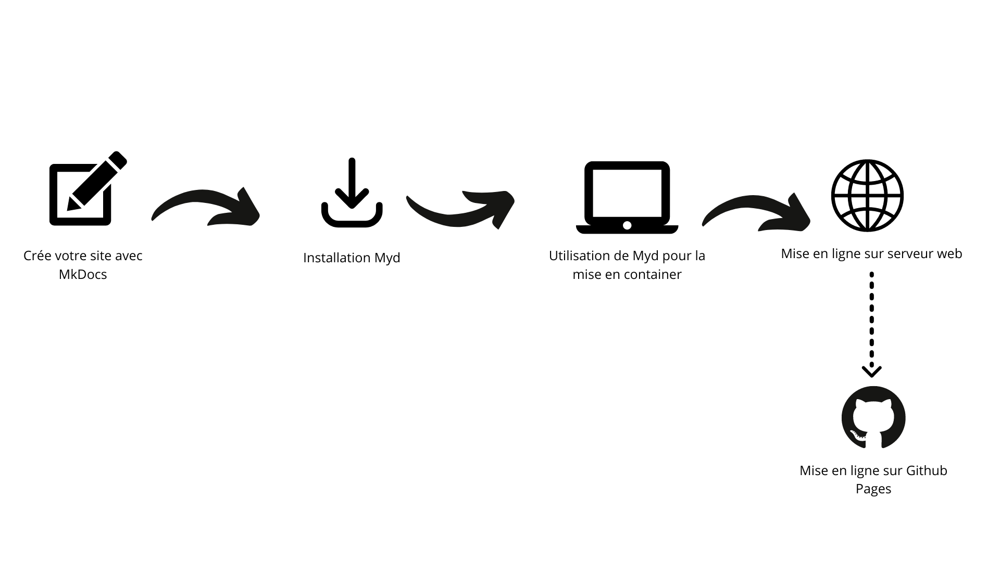

# Myd

**Documentation** : <a href="https://lennydelgado.github.io/Myd-project/" target="_blank">https://lennydelgado.github.io/Myd-project/</a>

**Source Code** : <a href="https://github.com/lennydelgado/Myd-project" target="_blank">https://github.com/lennydelgado/Myd-project</a>

---
 
Voici la documentation du projet **Myd** à destination de tous les usagers ou intervenant du projet, souhaitant comprendre les aspects fonctionnel et technique.
 

**Myd** est un outil qui permet d'automatiser la mise en container [Docker](https://www.docker.com/){.internal-link target=_blank} d'un site web généré par [MkDocs](https://www.mkdocs.org/){.internal-link target=_blank} ainsi que sa mise en ligne par serveur web [Nginx](https://www.nginx.com/){.internal-link target=_blank}.
 
 

### Fonctionnement du projet

